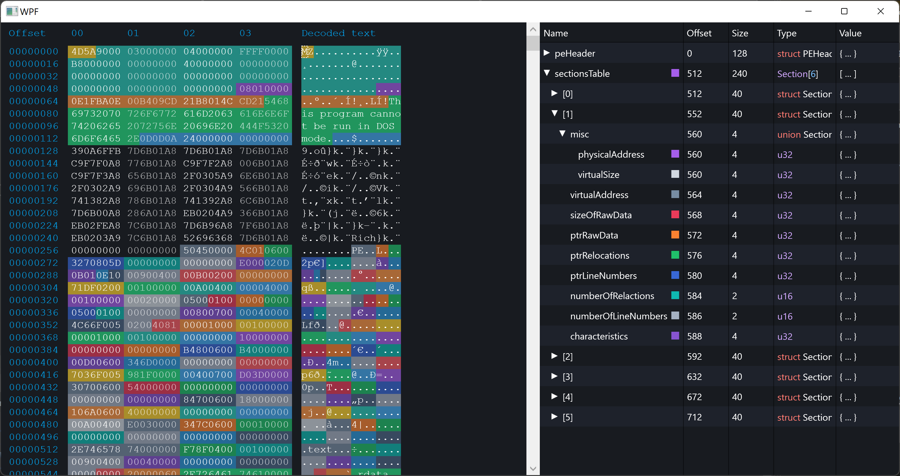
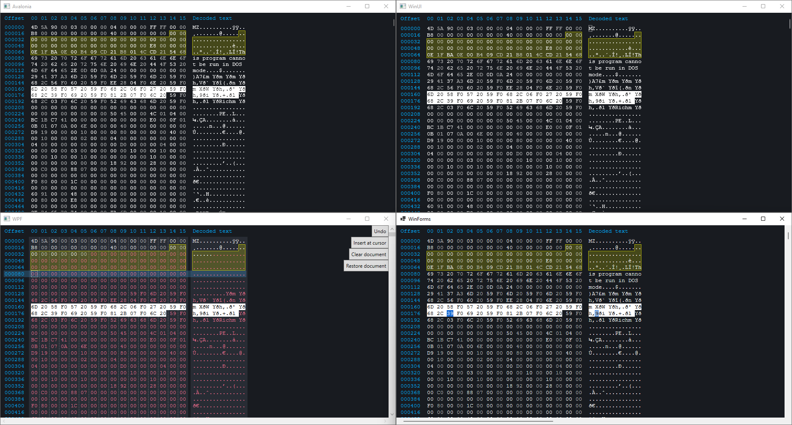

# HexEditorControl

A very much WIP hex editor control for WPF, Avalonia, Winforms and WinUI. In current state not usable.

## Why Direct2D?

After trying SkiaSharp, Win2D, WriteableBitmap and Direct2D, I made the decision to use Direct2D. See below the advantages and disadvantages I have faced. Note that these are based on rendering a large amount of text, 5000+ characters with ~5 different colors. Meaning, for use cases such as rendering a lot of shapes the advantages and disadvantages will vary.

For Avalonia the built-in `DrawingContext` is used, internally this context relies on SkiaSharp and is fast.

### Direct2D

**Advantages**
 - Easy to use in Windows UI frameworks: WinForms and WinUI, relatively easy to use in WPF.
 - Drawing cleartype text is extremly fast.
 - GPU accelerated by default.

**Disadvantages**
 - Slower on WPF compared to, for example, SkiaSharp, but still acceptable performance.

### SkiaSharp
**Advantages**
 - CPU based rendering is extremely fast.

**Disadvantages**
 - Having to include a 8MB native library: `libskiasharp.dll`.
 - No easy way to do GPU acceleration, it requires an OpenGL context, which in turn requires a native library such as `OpenTK.dll`.
 - ClearType text drawn with SkiaSharp does not "feel" like rendered text belonging to Windows UI frameworks compared to, say, GDI and Direct2D. The letters appear to be too thin and not crisp.

### WriteableBitmap

**Advantages**
 - CPU-based pixel rendering using WriteableBitmapEx is easy and fast, such as drawing non-anti-aliased shapes.

**Disavantages**
  - Drawing text is not straightforward, for this you need to pre-render glyphs with a predefined background color with for example GDI. When not pre-rendering with a background color, cleartype text will not be possible.

### Win2D
**Advantages**
 - No outstanding advantages.

**Disavantages**
 - Drawing text felt slow compared to other render frameworks.
 - Barely any documentation.
 - Only compatible with WinUI and UWP.
